# The Battle of the Neighborhoods - Week 1

## Introduction :

**Paris** and **New York** are two major economical and multicultural cites. Both cities become a centre of attention for business, job employment, tourism, residential, education, shopping and sports activities.

This work will be focused on creating and visualizing neighborhood's profiles in boroughs of **Paris** and **New York City**. These profiles will be based on the numbers and categories of venues present in each neighborhood in these cities, classifying each neighborhood based on statistical data and automated analysis using classification algorithms (K-means). Hopefully, these city profiles can give valuable insights about the life and economy of each region, making possible better-informed decision making for business and better public policymaking. Naturally, the target audience of this work are urban planners, policymakers, or urban services business looking to expand. This work is an extrapolation of the idea suggested in the assignment instructions.

## Business Problem :

The main business problem attacked in this work is based on how to determine the optimum location for a new business, a restaurant, bar, or office building. This problem can be solved by means of inferred data about already existing business. Naturally certain types of enterprises tend to be built in the same areas, through economic incentive or public regulations. Data about venue category density in a neighborhood can provide valuable information about **probable new markets** or **regions with low offerings in certain types of service**. It is important to also mention that the inexistence of certain types of enterprises can also mean that there is no demand for their services, indicating just data about venues, without additional socioeconomic information about the regions, is not sufficient data for constructing a complete picture. Nevertheless, it is possible to construct robust profiles about the urban makeup of the cities, sufficient for kickstarting the plans for new business, and this will be our main goal.

## Data & Tools Description :

This work is about analysing two famous and multicultural cities : Paris and New York City. The boroughs and neighborhoods names and geometric informations of **Paris** are extracted from *Open data website* which provide all the datasets published by Paris city departments and its partners under an **ODbL license**. For **New York City**, the data is provided by the course in previous assignments in a JSON file and the original source of the this dataset exists for free on the website : ***New York University - Spatial Data Repository***. The coordinates will be utilized for map generation, and as input for the Foursquare API, that will be leveraged to provision venues information for each neighborhood

We will focus on the venue category parameter, refining and clustering different categories of venues in major groups that will facilitate the analysis and also make possible the generation of better visualizations. Clustering algorithms like K-Means will be used to automatically group the neighborhoods in similar groups. *Plotly* and *Folium* Python packages are used for data rendering and visualization, providing rich graphs and maps.

#### Example of features extracted from Foursquare API :

A sample of the venue data extracted with Foursquare API calls is showed in the picture below (New York City):

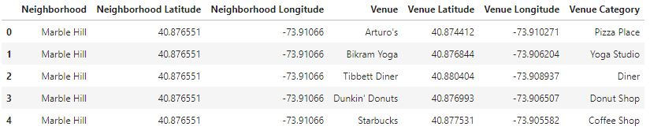

### 1- Python packages and Dependencies :

-	**Pandas**	    – 	Library for Data Analysis
-	**NumPy** 	    – 	Library to handle data in a vectorized manner
-	**JSON** 	      – 	Library to handle JSON files
-	**Geopy**	      – 	To retrieve Location Data 
-	**Requests** 	  – 	Library to handle http requests
-	**Matplotlib**	– 	Python Plotting Module
-	**Sklearn** 	  – 	Python machine learning Library
-	**Folium** 	    – 	Map rendering Library
- **Plotly**  	  –   is a Python data visualization library

### 2- APIs :

**Foursquare API :** This project would use Four-square API as its prime data gathering source as it has a database of more than 105 million places, especially their places API which provides the ability to perform location search, location sharing and details about a business. Photos, tips and reviews jolted by Foursquare users can also be used in many productive ways to add value to the results. 

### 3- Dataset sources :

[1] https://opendata.paris.fr/explore/dataset/arrondissements/information/ : Paris Boroughs data

[2] https://opendata.paris.fr/explore/dataset/quartier_paris/information/  : Paris Neighborhoods data

[3] https://geo.nyu.edu/catalog/nyu_2451_34572 : New york Boroughs and Neighborhoods data

[4] https://geo.nyu.edu/catalog/nyu-2451-34561 : Geojson file to plot boroughs tabulation areas

[5] https://geo.nyu.edu/catalog/nyu-2451-34490 : Geojson file to plot neighborhoods tabulation areas

## 4- Methodology section :

### 4.1- Business Understanding
Our main goal is to create a reliable profile of the neighborhoods in New York City and Paris. Our fictional business clients are two entrepeneurs, one looking to open a new restaurant in New York City and another one looking to open a new bar in Paris.

### 4.2- Analytic Approach

To decide the ideal neighborhood for the new business, we must classify the neighborhoods into differents kinds of regions based on the proportion of venue categories present in each one.

After the necessary data preparation (collection, encoding and normalization) the neighborhoods will be clustered into five groups using the k-means clustering algorithm. To solve our business problem, the cluster that contains most **Going Out** type of venues will be further studied, and the venue categories in these neighborhoods in this group will be expanded, to give insight in the kinds of places that do not already exist in these neighborhoods. The information can help our business clients decide what kind of restaurant or bar & club are lacking and are probbable bunsiness opportunities.

### 4.3- Data Requirements
As discussed in the Data & Tools section, the data requirements for this research are the venue information for each neighborhood in Paris and New York City. Consequently, information about the neighborhoods (names and geographical coordinates) are also necessary.

### 4.4- Data Collection & Understanding
The required data is collected in the first parts of the Jupyter Notebook. Paris boroughs and neighborhoods are downloded from the **Open Data plateform**, links in [1] & [2] gives all necessary data format (Csv, Json, geoJson). The New York City boroughs and neighborhoods information is available from the JSON file provided in [3], and geoJson informations also available in links [4] and [5].

At this point the data is organized in a Pandas DataFrame like the following:

 - **Paris Base Dataframe :**

  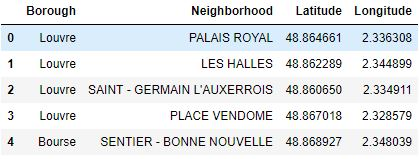
  
 - **New York City Base Dataframe :**

  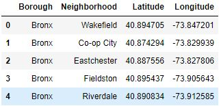
  

The **New York City** dataframe has 5 boroughs and 302 neighborhoods, and **Paris** dataframe has 20 boroughs and 124 neighborhoods. With the data collected at this point we can already visualize geographically each neighborhood using the Folium package to generate interactive Leaflet maps.

- **Paris boroughs tablulation areas visualization :**

  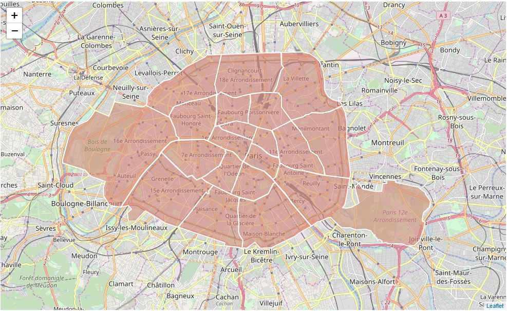

- **Paris Neighborhoods tablulation areas visualization :**

  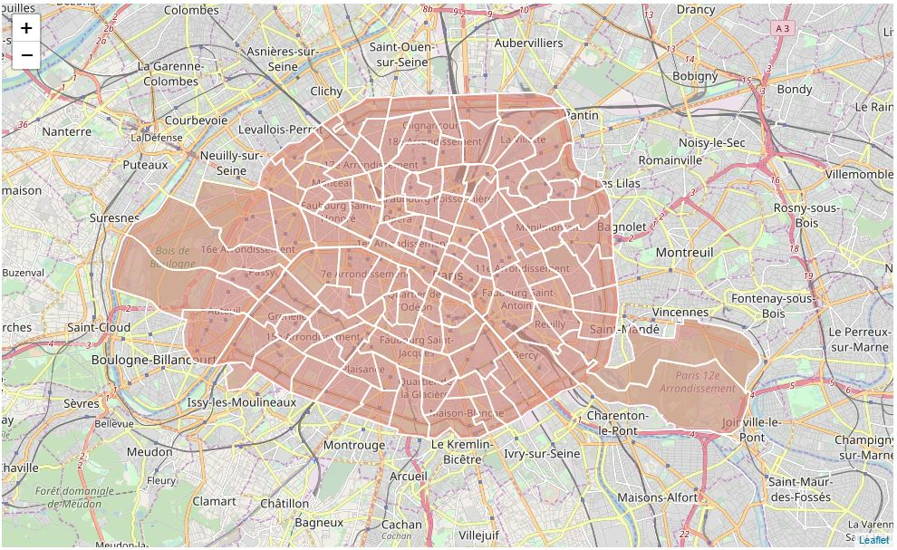

- **New York City boroughs tablulation areas visualization :**

  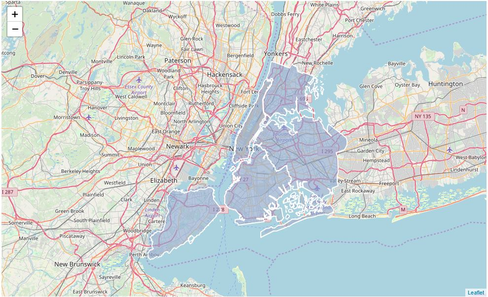

- **New York City Neighborhoods tablulation areas visualization :**

  
  
  
Departing from the same DataFrame, we now use the Foursquare API to collect venue data. Using the geographical coordinates of each neighborhood, API calls are made requesting the top 100 venues in a radius of 500 meters. The results are inserted in a new pandas dataframe, as presented in the following pictures : 

 - **Paris venues Dataframe :**

  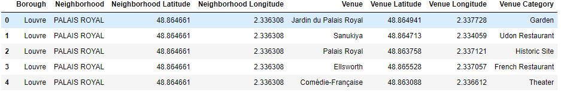
  
 - **New York City venues Dataframe :**

  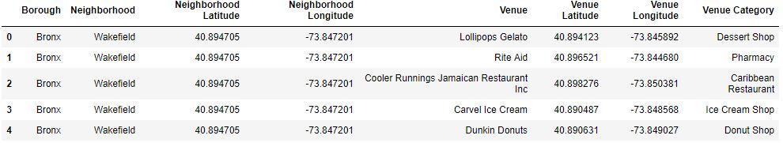

The **"paris_venues"** dataframe has 7849 venues and 324 unique venue types, and the **"newyork_venues"** dataframe has 10265 venues and 429 unique venue types. The proportion in number of venues are expected, considering the population and population density of these two cities.

 - **Paris venues Map Visualization :**

  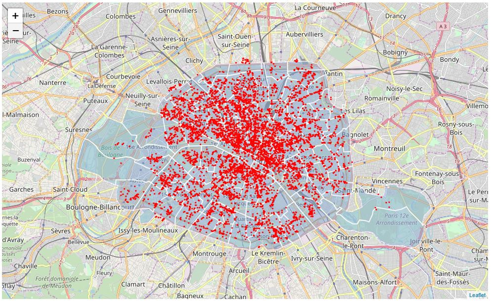
  
 - **New York City venues Map Visualization :**

  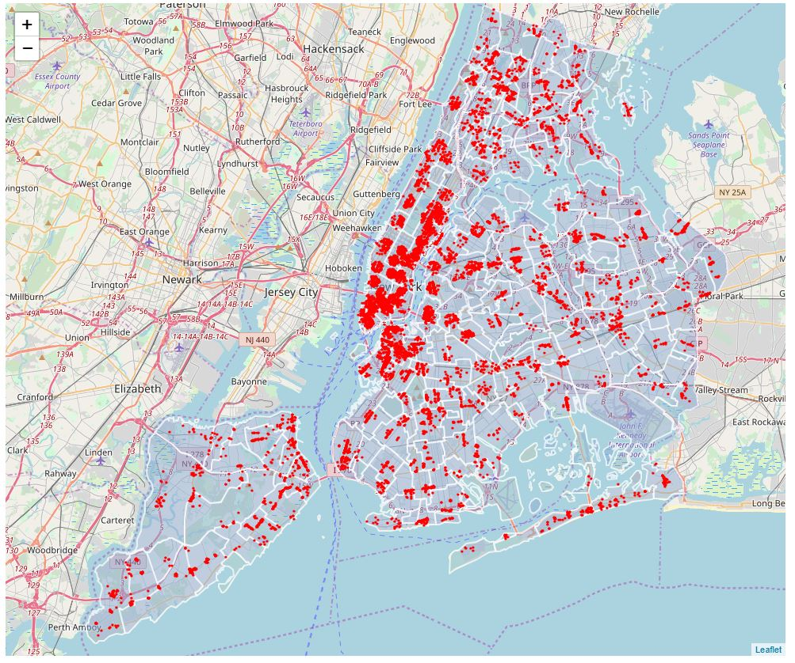
  
**Manually group Foursquare's venues categories found in Paris & New York City**

The Venue Category data extracted with the Foursquare API is very granular, to facilitate the visualization of data the 324 unique types of venues in Paris and the 429 unique types of venues in New York City will be grouped into eight larger categories:

- Bars and Clubs
- Restaurants
- General Services
- Leisure & Sports
- Culture & Education
- Parks & Nature
- Transportation Infrastructure
- Residential

In the image below we can see the total number of collected subcategories for each larger category. This classification was made by hand, because the Foursquare API do not provide hierarchical category information.

  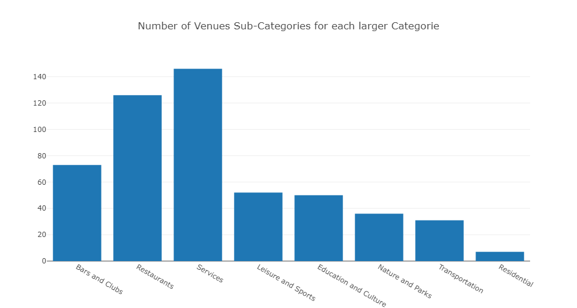

The Total collected subcategories between Paris & New York City are organized to larger categories in a csv file named : **"venues_categories.csv"**

**Data Encoding**

The next important step is the preparation of the data for the clustering/classification algorithms we are going to use later. Usually, only numeric inputs are valid in these algorithms, so in this section of our Jupyter Notebook the dataframes with venue data collected and classified so far is encoded, creating a bigger dataframe following the model in the picture below:

 - **Paris encoded dataframe for clustering :**

  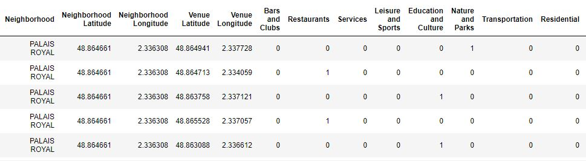
  
 - **New York City dataframe for clustering :**

  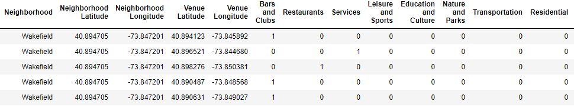
  

This data is then grouped for each Neighborhood, resulting in a dataframe with the number of venues in each category for each neighborhood. With this data prepared, we can generate several rich visualizations about the statistical venue makeup of Paris and New York.

**Understanding the Data Collected**

In this section we list some visualizations and distributions relevants to the topic of this work. First, a histogram chart about the number of venues collected for each neighborhood and the correspondent distribution of neighborhoods based on the number of venues collected.

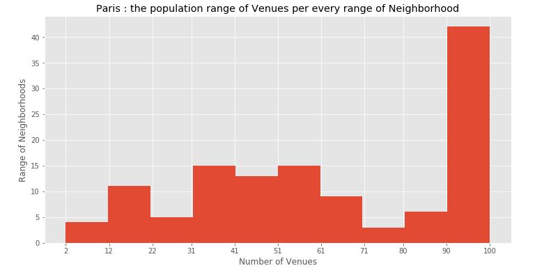
  
For Paris we have unfair distribution of venues because several neighborhoods have 100 venues whereas several other neaborhoods have a very few number of venues.

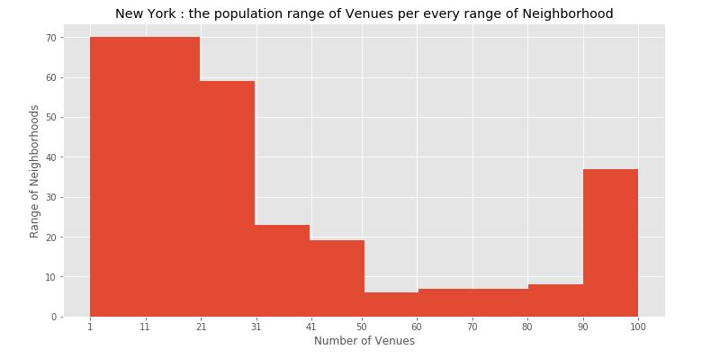

As it can be noted, New York City have several neighborhoods with "1-31" venues and an intermediary numberof neigborhoods with 100 venues.

