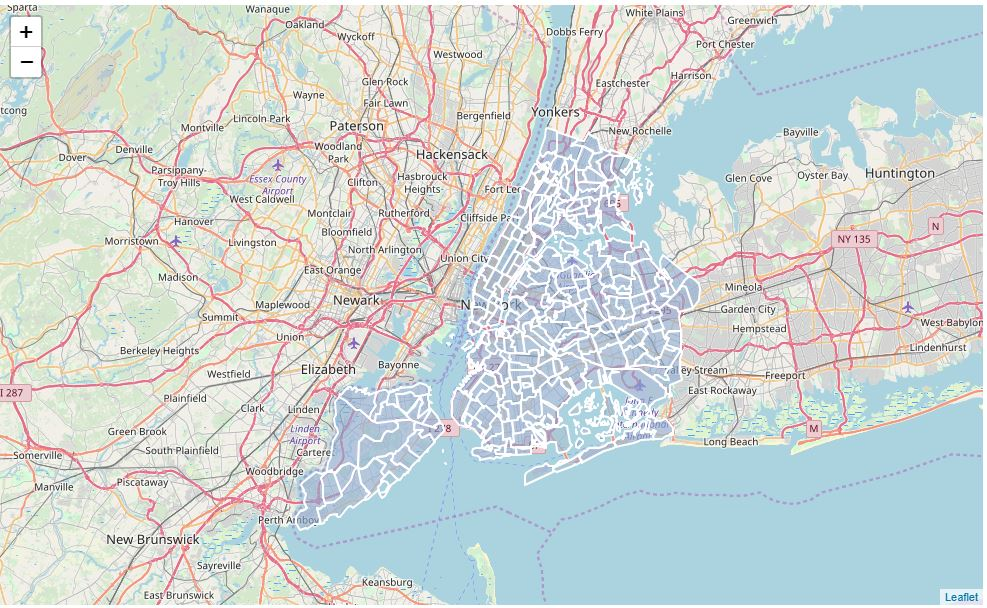
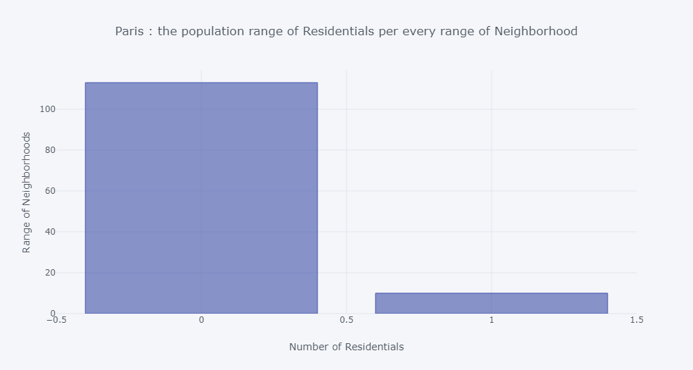
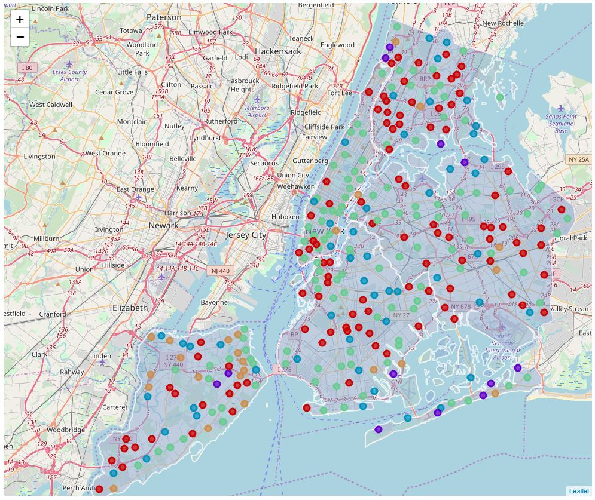

# The Battle of the Neighborhoods - Week 1

## Introduction

**Paris** and **New York** are two major economical and multicultural cites. Both cities become a centre of attention for business, job employment, tourism, residential, education, shopping and sports activities.

This work will be focused on creating and visualizing neighborhood's profiles in boroughs of **Paris** and **New York City**. These profiles will be based on the numbers and categories of venues present in each neighborhood in these cities, classifying each neighborhood based on statistical data and automated analysis using classification algorithms (K-means). Hopefully, these city profiles can give valuable insights about the life and economy of each region, making possible better-informed decision making for business and better public policymaking. Naturally, the target audience of this work are urban planners, policymakers, or urban services business looking to expand. This work is an extrapolation of the idea suggested in the assignment instructions.

## Business Problem

The main business problem attacked in this work is based on how to determine the optimum location for a new business, a restaurant, bar, or office building. This problem can be solved by means of inferred data about already existing business. Naturally certain types of enterprises tend to be built in the same areas, through economic incentive or public regulations. Data about venue category density in a neighborhood can provide valuable information about **probable new markets** or **regions with low offerings in certain types of service**. It is important to also mention that the inexistence of certain types of enterprises can also mean that there is no demand for their services, indicating just data about venues, without additional socioeconomic information about the regions, is not sufficient data for constructing a complete picture. Nevertheless, it is possible to construct robust profiles about the urban makeup of the cities, sufficient for kickstarting the plans for new business, and this will be our main goal.

## Data & Tools Description

This work is about analysing two famous and multicultural cities : Paris and New York City. The boroughs and neighborhoods names and geometric informations of **Paris** are extracted from *Open data website* which provide all the datasets published by Paris city departments and its partners under an **ODbL license**. For **New York City**, the data is provided by the course in previous assignments in a JSON file and the original source of the this dataset exists for free on the website : ***New York University - Spatial Data Repository***. The coordinates will be utilized for map generation, and as input for the Foursquare API, that will be leveraged to provision venues information for each neighborhood

We will focus on the venue category parameter, refining and clustering different categories of venues in major groups that will facilitate the analysis and also make possible the generation of better visualizations. Clustering algorithms like K-Means will be used to automatically group the neighborhoods in similar groups. *Plotly* and *Folium* Python packages are used for data rendering and visualization, providing rich graphs and maps.

#### Example of features extracted from Foursquare API :

A sample of the venue data extracted with Foursquare API calls is showed in the picture below (New York City):

### 1- Python packages and Dependencies :

-	**Pandas**	    – 	Library for Data Analysis
-	**NumPy** 	    – 	Library to handle data in a vectorized manner
-	**JSON** 	      – 	Library to handle JSON files
-	**Geopy**	      – 	To retrieve Location Data 
-	**Requests** 	  – 	Library to handle http requests
-	**Matplotlib**	– 	Python Plotting Module
-	**Sklearn** 	  – 	Python machine learning Library
-	**Folium** 	    – 	Map rendering Library
- **Plotly**  	  –   is a Python data visualization library

### 2- APIs :

**Foursquare API :** This project would use Four-square API as its prime data gathering source as it has a database of more than 105 million places, especially their places API which provides the ability to perform location search, location sharing and details about a business. Photos, tips and reviews jolted by Foursquare users can also be used in many productive ways to add value to the results. 

### 3- Dataset sources :

[1] https://opendata.paris.fr/explore/dataset/arrondissements/information/ : Paris Boroughs data

[2] https://opendata.paris.fr/explore/dataset/quartier_paris/information/  : Paris Neighborhoods data

[3] https://geo.nyu.edu/catalog/nyu_2451_34572 : New york Boroughs and Neighborhoods data

[4] https://geo.nyu.edu/catalog/nyu-2451-34561 : Geojson file to plot boroughs tabulation areas

[5] https://geo.nyu.edu/catalog/nyu-2451-34490 : Geojson file to plot neighborhoods tabulation areas

## Methodology

### 1- Business Understanding
Our main goal is to create a reliable profile of the neighborhoods in New York City and Paris. Our fictional business clients are two entrepeneurs, one looking to open a new restaurant in New York City and another one looking to open a new bar in Paris.

### 2- Analytic Approach

To decide the ideal neighborhood for the new business, we must classify the neighborhoods into differents kinds of regions based on the proportion of venue categories present in each one.

After the necessary data preparation (collection, encoding and normalization) the neighborhoods will be clustered into five groups using the k-means clustering algorithm. To solve our business problem, the cluster that contains most **Going Out** type of venues will be further studied, and the venue categories in these neighborhoods in this group will be expanded, to give insight in the kinds of places that do not already exist in these neighborhoods. The information can help our business clients decide what kind of restaurant or bar & club are lacking and are probbable bunsiness opportunities.

### 3- Data Requirements
As discussed in the Data & Tools section, the data requirements for this research are the venue information for each neighborhood in Paris and New York City. Consequently, information about the neighborhoods (names and geographical coordinates) are also necessary.

### 4- Data Collection & Understanding
The required data is collected in the first parts of the Jupyter Notebook. Paris boroughs and neighborhoods are downloded from the **Open Data plateform**, links in [1] & [2] gives all necessary data format (Csv, Json, geoJson). The New York City boroughs and neighborhoods information is available from the JSON file provided in [3], and geoJson informations also available in links [4] and [5].

At this point the data is organized in a Pandas DataFrame like the following:

 - **Paris Base Dataframe :**

  
  
 - **New York City Base Dataframe :**

  
  

The **New York City** dataframe has 5 boroughs and 302 neighborhoods, and **Paris** dataframe has 20 boroughs and 124 neighborhoods. With the data collected at this point we can already visualize geographically each neighborhood using the Folium package to generate interactive Leaflet maps.

- **Paris boroughs tablulation areas visualization :**

  

- **Paris Neighborhoods tablulation areas visualization :**

  

- **New York City boroughs tablulation areas visualization :**

  

- **New York City Neighborhoods tablulation areas visualization :**

  
  
  
Departing from the same DataFrame, we now use the Foursquare API to collect venue data. Using the geographical coordinates of each neighborhood, API calls are made requesting the top 100 venues in a radius of 500 meters. The results are inserted in a new pandas dataframe, as presented in the following pictures : 

 - **Paris venues Dataframe :**

  
  
 - **New York City venues Dataframe :**

  

The **"paris_venues"** dataframe has 7849 venues and 324 unique venue types, and the **"newyork_venues"** dataframe has 10265 venues and 429 unique venue types. The proportion in number of venues are expected, considering the population and population density of these two cities.

 - **Paris venues Map Visualization :**

  
  
 - **New York City venues Map Visualization :**

  
  
**Manually group Foursquare's venues categories found in Paris & New York City**

The Venue Category data extracted with the Foursquare API is very granular, to facilitate the visualization of data the 324 unique types of venues in Paris and the 429 unique types of venues in New York City will be grouped into eight larger categories:

- Bars and Clubs
- Restaurants
- General Services
- Leisure & Sports
- Culture & Education
- Parks & Nature
- Transportation Infrastructure
- Residential

In the image below we can see the total number of collected subcategories for each larger category. This classification was made by hand, because the Foursquare API do not provide hierarchical category information.

  

The Total collected subcategories between Paris & New York City are organized to larger categories in a csv file named : **"venues_categories.csv"**

**Data Encoding**

The next important step is the preparation of the data for the clustering/classification algorithms we are going to use later. Usually, only numeric inputs are valid in these algorithms, so in this section of our Jupyter Notebook the dataframes with venue data collected and classified so far is encoded, creating a bigger dataframe following the model in the picture below:

 - **Paris encoded dataframe for clustering :**

  
  
 - **New York City dataframe for clustering :**

  
  

This data is then grouped for each Neighborhood, resulting in a dataframe with the number of venues in each category for each neighborhood. With this data prepared, we can generate several rich visualizations about the statistical venue makeup of Paris and New York.

**Understanding the Data Collected**

In this section we list some visualizations and distributions relevants to the topic of this work. First, a histogram chart about the number of venues collected for each neighborhood and the correspondent distribution of neighborhoods based on the number of venues collected.

  
For Paris we have unfair distribution of venues because several neighborhoods have 100 venues whereas several other neaborhoods have a very few number of venues.

As it can be noted, New York City have several neighborhoods with "1-31" venues and an intermediary number of neigborhoods with 100 venues.

**Bars & Clubs Distribution in Each City**

Creating bar plots but only considering venues of the "Bars & Clubs" category, we can have an idea about the number of these types of business in each city and also their distribution between different neighborhoods. Both cities have some neighborhoods with several Bars & Clubs, indicating that there are agglomerations of business of the same kind at certain locations that will be further studied.

Comparing both distributions we can conclude that the restaurant business in Paris is much more saturated than in New York City.

**Restaurants Distribution in Each City**

Creating bar plots but only considering venues of the "Restaurants" category, we can have an idea about the number of these types of business in each city and also their distribution between different neighborhoods. Both cities have some neighborhoods with several Restaurants, indicating that there are agglomerations of business of the same kind at certain locations that will be further studied.

The Restaurants distribution are much more different between Paris and New York City. In Paris this kind of business seems also saturated, with lots of places distributed between several neighborhoods, while in New York City there are much more inequality in restaurantss distribution between the neighborhoods - In New York City this kind of business is concentrated in few neighborhoods.

**Services Distribution in Each City**

The general services distribution is somewhat similar between the two cities, but still following the same pattern than the previous ones - Paris seems more saturated while in New York City some neighborhoods have a deficiency of services (**Nearly 30 neighborhoods without services venues in New York City**)

**Residentials Distribution in Each City**

## Results

### Neighborhood K-Means Clustering based on Mean Ocurrence of Each Larger Venue Category

With the previously encoded data, we will now aim to cluster the neighborhoods into five clusters, each one with different major characteristics. **K-means clustering** is the algorithm that will be used - this algorithm aims to partition n observations into k clusters in which each observation belongs to the cluster with the nearest mean. K-Means uses an iterative refinement technique, and it is also referred to as Lloyd's algorithm. In the next pictures we show how the five clusters are characterised, in terms of median percent share of each kind of neighborhood.

#### Clusters of Paris

The Paris City clusters are presented below.

**Cluster 1** aggregates neighborhoods with the highest proportion of restaurants in Paris, followed by services and then bars. So the cluster indicate that these regions for some reason are attracting business related to nightlife and food.

**Cluster 2** aggregates neighborhoods with balanced shares of services, restaurants, bars and clubs. This cluster also has a few parks and nature proportional share, indicating that neighborhoods in these areas are also an urbanized parts of the city, indicating high development.

**Cluster 3** aggregates neighborhoods with a a huge proportion of restaurants, followed by services and then bars. The parks and nature proportiona share in this cluster is higher than similar type of clusters in New York.

**Cluster 4** aggregates neighborhoods with a high prevalence of parks and nature, followed by leisure and sports. There are services, restaurants and bars but they aren't a common occurence in these areas. Here we also have the neighborhoods with the highest proportional share of the higher proportiona of transportation infrastructure compared to other cluster in Paris.

**Cluster 5** aggregates neighborhoods with a huge proportional share of restaurants, followed by bars & clubs, and also serivces, indicating that these regions for some reason are attracting business related to nightlife and food.

In the map below we can see the geographical visualization of the different types of clusters created using K-Means for Paris.

This is the clusters neighborhoods color representation in the Map of Paris:

- Cluster 1 : **Red**
- Cluster 2 : **Purple**
- Cluster 3 : **Bleu**
- Cluster 4 : **Green**
- Cluster 5 : **Orange**

#### Clusters of New York City

The New York City clusters are presented below.

**Cluster 1** aggregates neighborhoods with a huge  proportion of services venues, followed by bars and restaurants, indicating that these neighborhoods are probably commercial districts or city centers. 

**Cluster 2** aggregates neighborhoods with the highest prevalence of parks and nature (proportional share of 53.2%), and also transportation infrastructure. There are services, restaurants and bars but they aren't a common occurence in these areas.

**Cluster 3** aggregates neighborhoods with a huge proportion of bars and clubs, followed by restaurants and services, indicating that that these regions for some reason are attracting business related to nightlife and food.

**Cluster 4** aggregates the largest proportion of restaurants of all clusters, then followed by bars and also services venues, meaning that neighborhoods grouped in this cluster are important entities of study for our business problem related to restaurants and bars distribution.

**Cluster 5** aggregates the largest proportion of transportation infrastructures and residentials of all clusters. This cluster also has a low proportional share of parks and nature, indicating that neighborhoods in these areas are highly urbanized parts of the city.

In the map below we can see the geographical visualization of the different types of clusters created using K-Means for New York City. 

This is the clusters neighborhoods color representation in the Map of New York City:

- Cluster 1 : **Red**
- Cluster 2 : **Purple**
- Cluster 3 : **Bleu**
- Cluster 4 : **Green**
- Cluster 5 : **Orange**

### Paris Analysis

For Paris, we selected the clusters 1, 2, 3 and 5. The cluster 4 aggregates neighborhoods with high numbers of bars and good demand and accessibility for the public (suburban areas), indicating places with lower rents and property prices - relative to city center neighborhoods, of the also selected cluster 2. Cluster 2 groups the more urbanized and developed parts of Paris, with several services category venues - making these areas great neighborhoods with high demand for restaurants, bars, nightclubs, etc. The list of neighborhoods in this cluster is presented below, and they basically form a list of places with well established business in the restaurant/bar/clubs segment. The optimal location for a new business in the restaurant or bar category can be further studied with the granular data about the specific themes of restaurants and bars. High demand signals high offerings and also higher competitivity, meaning that it's probably better to start a "new" kind of venue, in an untapped market in an underdeveloped or suburban area.

#### Good neighborhoods for establishing new restaurant venues in Paris (possible untapped markets):

BASSIN DE LA VILLETTE, ALIGRE - GARE DE LYON, SAINT - THOMAS D'AQUIN, TRIANGLE D'OR, SAINT - PHILIPPE DU ROULE, ALLERAY - PROCESSION, RENNES, HOCHE - FRIEDLAND, REPUBLIQUE - SAINT-AMBROISE, PLACE VENDOME, ARCHIVES, GOUTTE D'OR - CHATEAU ROUGE, MANIN - JAURES, ECOLE MILITAIRE, ODEON, BERCY, SAINT - MERRI, ENFANTS ROUGES, ELYSEES - MADELEINE, SAINT BLAISE, AMIRAUX - SIMPLON - POISSONNIERS, MOSKOWA - PORTE MONTMARTRE - PORTE DE CLIGNANCOURT, FLANDRE - AUBERVILLIERS, SAINT - GERMAIN L'AUXERROIS, OPERA - CHAUSSEE D'ANTIN, PLACE DES FETES, BEL - AIR NORD, TERNES - MAILLOT, MASSENA - JEANNE D'ARC, SALPETRIERE - AUSTERLITZ, FAUBOURG MONTMARTRE, SAINT - PLACIDE, MOUTON - DUVERNET, ROSA PARKS - MACDONALD, GEORGES BRASSENS, LES HALLES, SAINT - GERMAIN DES PRES, LES ILES, CHAMPERRET - BERTHIER, DIDOT - PORTE DE VANVES, REUNION - PERE LACHAISE, MAIRIE, MUETTE SUD, EPINETTES - BESSIERES, VAUGIRARD - PARC DES EXPOSITIONS, NATION - PICPUS, CHAILLOT, ANVERS - MONTHOLON, LA FOURCHE - GUY MOQUET, ARSENAL, EUROPE, INVALIDES, LA CHAPELLE - MARX DORMOY, GAMBETTA, DUPLEIX - LA MOTTE PICQUET, PONT DE FLANDRE, JARDIN DE REUILLY, MONTPARNASSE - RASPAIL, EMERIAU - ZOLA, BIBLIOTHEQUE - SEINE, PALAIS ROYAL, SORBONNE, CITROEN - BOUCICAUT, ITALIE - PEUPLIERS - RUNGIS, JEAN MOULIN - PORTE D'ORLEANS, JARDIN DES PLANTES, Non renseigné, TELEGRAPHE - PELLEPORT - SAINT-FARGEAU, PLAINE LAGNY, NATION - ALEXANDRE DUMAS, GRANGE AUX BELLES - TERRAGE, NOTRE - DAME DES CHAMPS, PLATEAU, CROULEBARBE, LEGENDRE - LEVIS, GRANDES CARRIERES - CLICHY, BUTTES AUX CAILLES - DAVIEL - BOUSSINGAULT, ARTS ET METIERS, SECRETAN, LEON BLUM - FOLIE-REGNAULT, CHATEAU D'EAU - LANCRY, CLIGNANCOURT - JULES JOFFRIN, SAINT - VICTOR, PIGALLE - MARTYRS, MONNAIE, PASTEUR - MONTPARNASSE, FAUBOURG DU TEMPLE - HOPITAL SAINT-LOUIS, BELLEVILLE, SAINT - GERVAIS, BASTILLE - POPINCOURT, BELLEVILLE - SAINT-MAUR, VAL DE GRACE, CAMBRONNE - GARIBALDI, MONCEAU, MONTORGUEIL - SAINT-DENIS, SAINT - AVOYE, DANUBE, MONTMARTRE, BLANCHE - TRINITE, SENTIER - BONNE NOUVELLE, AMANDIERS - MENILMONTANT.

#### Good neighborhoods for restaurant venues in Paris (but probably saturated markets):

NATIONALE - DEUX MOULINS, OLYMPIADES - CHOISY, MONTSOURIS - DAREAU, LOUIS BLANC - AQUEDUC, AUTEUIL SUD, VIOLET - COMMERCE, BATIGNOLLES - CARDINET, PORTE SAINT-DENIS - PARADIS, COURCELLES - WAGRAM, SAINT - VINCENT DE PAUL - LARIBOISIERE, BAS - BELLEVILLE, VIVIENNE - GAILLON, GROS CAILLOU, PERNETY, PEREIRE - MALESHERBES, SAINT - LAMBERT.

### New York City Analysis

For New York City, we selected the clusters 3 and 4. The cluster 4 aggregates neighborhoods with high proportion of restaurants but balanced proportions of services, and bars/clubs. Comparing cluster 4 with cluster 3, that aggregates city center neighborhoods with very high proportional share of bars & clubs and also relatively high proportion of restaurants, we can notice that cluster 4 is behind cluster 3 fairly close in the gentrification, or urban development process. This information can be used to plan the best locations for a restaurant business based on the intentions of our business client: does he want to open a restaurant in some place with high demand, but also high price of entry or he wants to bet in a place with less entrenched competitiors and also good demand? We list the possible neighborhoods for each group in the next subsection.

#### Good neighborhoods for establishing new restaurant venues in New York City (not so much competition and good demand - "safe bets"):

Greenridge, Williamsbridge, Longwood, Edgewater Park, Broad Channel, Remsen Village, Broadway Junction, Williamsburg, Van Nest, Throgs Neck, College Point, West Brighton, Morningside Heights, Flatbush, Gramercy, Lower East Side, Richmond Valley, Elm Park, Windsor Terrace, Woodhaven, Greenpoint, Madison, Shore Acres, Bedford Stuyvesant, Long Island City, Hudson Yards, Dyker Heights, Lighthouse Hill, Briarwood, Mariner's Harbor, Roxbury, Beechhurst, Woodlawn, Richmond Town, Belle Harbor, Mount Hope, East Williamsburg, Ocean Hill, Manhattan Beach, Country Club, South Ozone Park.

#### Good neighborhoods for establishing new clubs and bars in New York City (not so much competition and good demand - "safe bets"):

Hamilton Heights, Astoria, Unionport, Bushwick, Prospect Heights, Manor Heights, Manhattan Terrace, East Village, Yorkville, Great Kills, Woodside, Schuylerville, Sheepshead Bay, Tompkinsville, Arrochar, Fort Hamilton, Morris Park, Financial District, North Side, Noho, Murray Hill, Cobble Hill, Flushing, Richmond Hill, Rockaway Park, Rockaway Beach, Midtown South, New Dorp, Douglaston, Carroll Gardens, Carnegie Hill, South Side, Upper West Side, Inwood, Pelham Parkway, East New York, Rugby, Belmont, New Dorp Beach, Prince's Bay, Kingsbridge Heights, Forest Hills Gardens, North Riverdale, Sutton Place, Oakland Gardens, Bayside, Sunnyside Gardens, Manhattanville, Bay Ridge, Corona, Bath Beach, Stapleton, Park Slope, Bedford Park, Castleton Corners, Eltingville, Clinton, West Village, Manhattan Valley, Hunters Point, St. Albans, Annadale, Greenwich Village, North Corona, Ocean Parkway, Bulls Head, Middle Village, Chinatown, Upper East Side, Lenox Hill, Little Neck, Ravenswood, East Harlem, Clinton Hill, Brooklyn Heights, Hunts Point, Jamaica Hills, Gravesend, Turtle Bay, Bronxdale, Fulton Ferry, Murray Hill, Rosebank, Tudor City, Sunnyside, Fort Greene, Eastchester, Central Harlem.

#### Good neighborhoods for restaurant venues in New York City (but probably saturated markets - entrenched business):

Elmhurst, Paerdegat Basin, Cypress Hills, Prince's Bay, Olinville, Murray Hill, Canarsie, Floral Park, Ravenswood, Manhattanville, New Dorp, Laurelton, Hunts Point, Silver Lake, Jackson Heights, Greenwich Village, Sunnyside, Turtle Bay, Unionport, New Lots, Corona, South Side, Jamaica Hills, Midwood, Little Neck, Clinton Hill, Grant City, Chinatown, Mill Basin, University Heights, Tudor City, Bensonhurst, North Riverdale, Far Rockaway, Ridgewood, St. Albans, Annadale, Kingsbridge Heights, Manhattan Valley, East Village, Astoria, Belmont, Bronxdale, Schuylerville, Bedford Park, Bellerose, Bayside, Central Harlem, East Harlem, Manhattan Terrace, Bath Beach, Sheepshead Bay, Queensboro Hill, Great Kills, Upper West Side, Morris Park, New Dorp Beach, East New York, Oakland Gardens, Rockaway Beach, Bay Ridge, Prospect Heights, Park Slope, Murray Hill, Sunnyside Gardens, Brighton Beach, Eastchester, Fort Greene, Hamilton Heights, West Village, Hunters Point, Woodside, Rugby, Douglaston, Lenox Hill, Noho, Eltingville, Castleton Corners, Brownsville, City Island, Midtown South, Flatiron, Flushing, Forest Hills Gardens, Pelham Parkway, Rosebank, Kew Gardens Hills, Stapleton, Richmond Hill.

### Refining the results

From all the cities listed above, we can interact with the charts generated with Plotly in the Jupyter Notebook of this project and analyze the absolute number of restaurants and bars. Assuming that fewer restaurants are indicative of possible market opportunities we can refine the lists of clustered neighborhoods provided above:

#### Best Neighborhoods for Restaurants in Paris

BASSIN DE LA VILLETTE, ALIGRE - GARE DE LYON, SAINT - THOMAS D'AQUIN, TRIANGLE D'OR, SAINT - PHILIPPE DU ROULE, ALLERAY - PROCESSION, RENNES, HOCHE - FRIEDLAND, REPUBLIQUE - SAINT-AMBROISE, PLACE VENDOME, ARCHIVES, GOUTTE D'OR - CHATEAU ROUGE, MANIN - JAURES, ECOLE MILITAIRE, ODEON, BERCY.

#### Best Neighborhoods for Restaurants in NYC

Greenridge, Williamsbridge, Longwood, Edgewater Park, Broad Channel, Remsen Village, Broadway Junction, Williamsburg, Van Nest, Throgs Neck, College Point, West Brighton

## Conclusion

We finish this report with the conclusions of the study: a lot of assumptions are made to arrive at the final refined results. These assumptions can probably be wrong, and further study with more data must be taken to verify the quality of, or if any of the correlations really exist. Nevertheless our assumptions are simple and seem to be right: if there is a lot of restaurants in some area, it is probably because exists demand in this place. However, the market can also be saturated, or a very expensive area - considerations that our business sponsor must take into account when deciding where he will open his new restaurant. Because of these doubts, we researched two main types of neighborhoods: neighborhoods with high concentration of restaurant business (high competitivity) and also neighborhoods with good number of restaurants (indicating that some kind of demand exists) but not so many restaurants to make competition a problem. 

The business sponsor can safely choose one of the neighborhoods listed as best. For a more comprehensive decision, the specific venue type (if it is a Chinese restaurant, or Japanese one, etc.) can be checked - and the venue with the lowest competition can be chosen accordingly.
